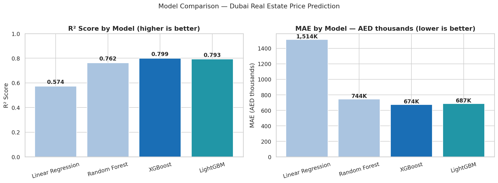

# 🏙️ Dubai Real Estate Price Predictor

> End-to-end ML pipeline predicting property sale prices in Dubai using **1,153,228 official transactions** from the Dubai Land Department (2004–2025).

[](https://python.org)
[](https://xgboost.readthedocs.io)
[](https://streamlit.io)
[](https://data.dubai.gov.ae)

## 🔴 [Live Demo → dubai-re-predictor.streamlit.app](https://dubai-re-predictor.streamlit.app/)

---

## 📊 Model Results

| Model | R² Score | MAE (AED) | RMSE (AED) |
|---|---|---|---|
| Linear Regression (baseline) | 0.5738 | 1,514,448 | 9,446,699 |
| Random Forest | 0.7625 | 743,936 | 1,593,793 |
| **XGBoost ← Best** | **0.7992** | **674,309** | **1,440,946** |
| LightGBM | 0.7926 | 686,944 | 1,477,968 |

> Trained on **835,360 rows**, tested on **317,868 rows** using a time-aware split (train: pre-2024, test: 2024+)

---

## 📈 Model Comparison



## 🎯 Predicted vs Actual


---

## 🔍 Key Findings from the Data

- 📍 **Most expensive area:** Wadi Al Safa 2 — AED 94,328/sqm
- 📍 **Most affordable area:** Al Khawaneej — AED 204/sqm
- 🏗️ **43.7% of all sales** are off-plan properties
- 📈 **2024 was the peak year** for transaction volume
- 💰 **Median sale price:** AED 1,347,141
- 🏠 **Price range** (cleaned): AED 210,000 — AED 23,599,000
- 📊 **XGBoost outperforms** Linear Regression by 39% on R²

---

## 🧠 SHAP Feature Importance

> Which features drive Dubai property prices the most?


> **How to read the beeswarm:** Red = high feature value, Blue = low. Points to the right push price **up**, left push price **down**.

---

## 🗂️ Project Structure

```
Dubai-Real-Estate-Price-Predictor/
│
├── notebooks/
│   ├── 01_EDA.ipynb           # Data cleaning, profiling, 8 visualisations
│   └── 02_modelling.ipynb     # Feature engineering, 4 models, SHAP
│
├── images/
│   ├── model_comparison.png
│   ├── predicted_vs_actual.png
│   ├── shap_importance.png
│   └── shap_beeswarm.png
│
├── app.py                     # Streamlit prediction app
├── xgboost_model.pkl          # Saved trained model
├── encoding_maps.json         # Target encoding maps
├── feature_cols.json          # Feature list
├── area_list.json             # Dubai area dropdown values
├── property_types.json        # Property type dropdown values
└── requirements.txt
```

---

## 🧪 Technical Approach

### Data
- **Source:** [Dubai Land Department — data.dubai.gov.ae](https://data.dubai.gov.ae)
- **Size:** 1,153,228 sales transactions (2004–2025), 46 columns
- **Cleaning:** Filtered to Sales only, removed zero/null prices, outlier removal (1%–99%)

### Feature Engineering
- `price_per_sqm` — sale price divided by area in sqm
- `is_offplan` — binary flag for off-plan vs ready properties
- `year`, `month`, `quarter` — extracted from transaction date
- Target encoding for `area_name_en`, `property_type_en`, `rooms_en`, `nearest_metro_en`
- Log transformation on target variable (`actual_worth`) to handle skew

### Models Trained
| | |
|---|---|
| Linear Regression | Baseline comparison |
| Random Forest | Ensemble, 100 estimators |
| **XGBoost** | **Best model — 500 estimators, depth 7** |
| LightGBM | Close second to XGBoost |

### Explainability
SHAP (SHapley Additive exPlanations) values used to identify top price drivers. `area_name`, `procedure_area`, `is_offplan`, and `year` are the strongest predictors.

---

## 🚀 Run Locally

```bash
# Clone the repo
git clone https://github.com/VikasVarmaMudunuru/Dubai-Real-Estate-Price-Predictor.git
cd Dubai-Real-Estate-Price-Predictor

# Install dependencies
pip install -r requirements.txt

# Run the Streamlit app
streamlit run app.py
```

---

## 📦 Requirements

```
streamlit
pandas
numpy
scikit-learn
xgboost
lightgbm
joblib
```

---

## 📁 Data Source

Data sourced from the **official Dubai Land Department** via [data.dubai.gov.ae](https://data.dubai.gov.ae), last updated January 2025. The dataset contains all real estate transaction types including sales, mortgages, and gifts recorded by the DLD since 2004.

---

## 👤 Author

**Vikas Varma Mudunuru**  
MSc Data Science & AI — Middlesex University Dubai  
[LinkedIn](https://www.linkedin.com/in/vikas-varma-mudunuru) · [GitHub](https://github.com/VikasVarmaMudunuru) · [Live App](https://dubai-re-predictor.streamlit.app/)
